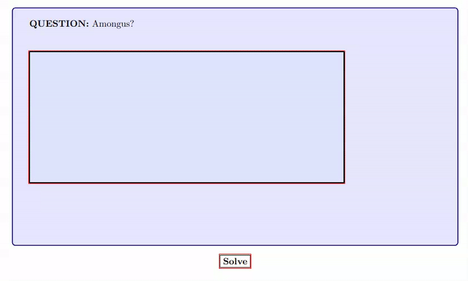

## Turn your jsons into latex flashcards




Given a json file with the following structure:

```json
[
    {
        "question": "What is the capital of France?",
        "answer": "Paris"
    },
    {
        "question": "What is the capital of Germany?",
        "answer": "Berlin"
    }
]
```

Like so:

```python
python src/flashcards.py filename.json
```

You will get a latex file `output.tex` with flashcards in it! You just have to compile it with your favorite latex compiler.

## Installation
```bash
sudo pacman -S latex-base latex-extra
```

